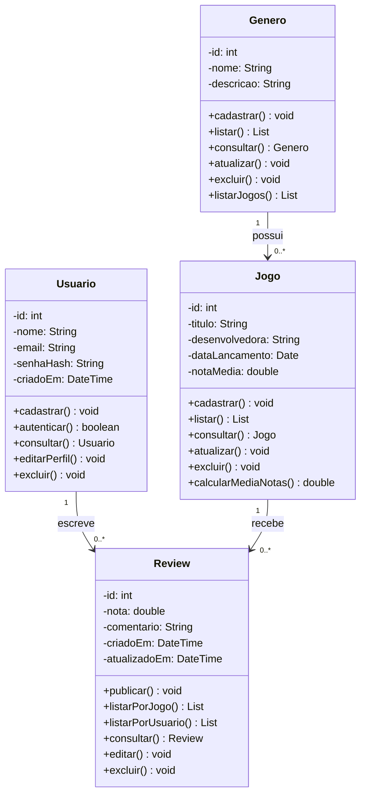

# Sistema de Reviews de Jogos

## Descrição do modelo

O sistema permite que usuários cadastrados publiquem avaliações (reviews) sobre jogos, organizados por gênero. O modelo possui quatro entidades de negócio relacionadas entre si:

- **Usuario:** pessoa cadastrada na plataforma (nome, e-mail, senha em hash).
- **Genero:** categoria dos jogos (nome, descrição).
- **Jogo:** título avaliado (título, desenvolvedora, data de lançamento, nota média).
- **Review:** avaliação de um usuário sobre um jogo (nota, comentário, datas de criação e atualização). Não é uma tabela de ligação: tem atributos e regras próprias.

### Relacionamentos

- Um usuário escreve várias reviews (1:N).
- Um jogo recebe várias reviews (1:N).
- Um gênero possui vários jogos (1:N).

## Diagrama de classes

## CRUD por entidade

Todas as operações de CRUD fazem sentido no domínio e estão previstas. Nenhuma foi omitida; algumas têm restrições, descritas na seção seguinte.

| Entidade | Create | Read | Update | Delete |
|---|---|---|---|---|
| Usuario | `cadastrar` | `consultar`, `autenticar` | `editarPerfil` | `excluir` |
| Genero | `cadastrar` | `listar`, `consultar`, `listarJogos` | `atualizar` | `excluir` |
| Jogo | `cadastrar` | `listar`, `consultar` | `atualizar` | `excluir` |
| Review | `publicar` | `listarPorJogo`, `listarPorUsuario`, `consultar` | `editar` | `excluir` |

## Regras de negócio

1. **E-mail único:** não podem existir dois usuários com o mesmo e-mail.
2. **Senha:** nunca é armazenada em texto puro, somente o hash (`senhaHash`).
3. **Autoria da review:** somente o autor pode editar ou excluir a própria review. Ao editar, o campo `atualizadoEm` é atualizado.
4. **Uma review por usuário por jogo:** um usuário não pode avaliar o mesmo jogo mais de uma vez; para mudar a opinião, ele edita a review existente.
5. **Nota válida:** a nota deve estar entre 0,0 e 10,0.
6. **Nota média:** `notaMedia` do jogo é recalculada (`calcularMediaNotas`) sempre que uma review for publicada, editada ou excluída.
7. **Excluir Genero:** bloqueado se houver jogos associados, para não deixar jogos sem gênero. O gênero só pode ser excluído quando estiver vazio.
8. **Excluir Jogo:** as reviews do jogo são excluídas em cascata, pois não fazem sentido sem o jogo avaliado.
9. **Excluir Usuario:** as reviews do usuário são excluídas em cascata e a `notaMedia` dos jogos afetados é recalculada.
10. **Gênero obrigatório:** todo jogo deve ter um gênero válido (`id_genero` não nulo).
