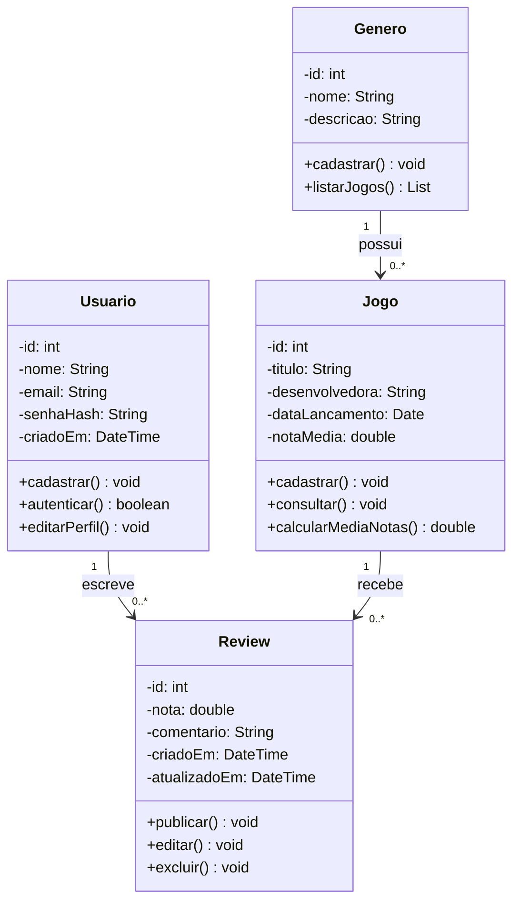

# Modelagem de Classes

O modelo representa um sistema de avaliações de jogos, onde usuários cadastrados publicam reviews sobre jogos organizados por gênero.

## Entidades

- **Usuario:** pessoa cadastrada na plataforma, com nome, e-mail e senha armazenada em formato hash. Pode se cadastrar, autenticar e editar o perfil.
- **Genero:** categoria de jogos (ação, RPG, etc.), com nome e descrição. Permite listar os jogos que pertencem a ela.
- **Jogo:** título avaliado na plataforma, com desenvolvedora, data de lançamento e nota média. Pode ser cadastrado, consultado e ter a média das notas calculada.
- **Review:** avaliação feita por um usuário sobre um jogo, com nota, comentário e datas de criação e atualização. Pode ser publicada, editada e excluída.

## Relacionamentos

- Um usuário escreve várias reviews (1:N), e cada review pertence a um único usuário.
- Um jogo recebe várias reviews (1:N), e cada review avalia um único jogo.
- Um gênero possui vários jogos (1:N), e cada jogo pertence a um único gênero.

## Modelo :

